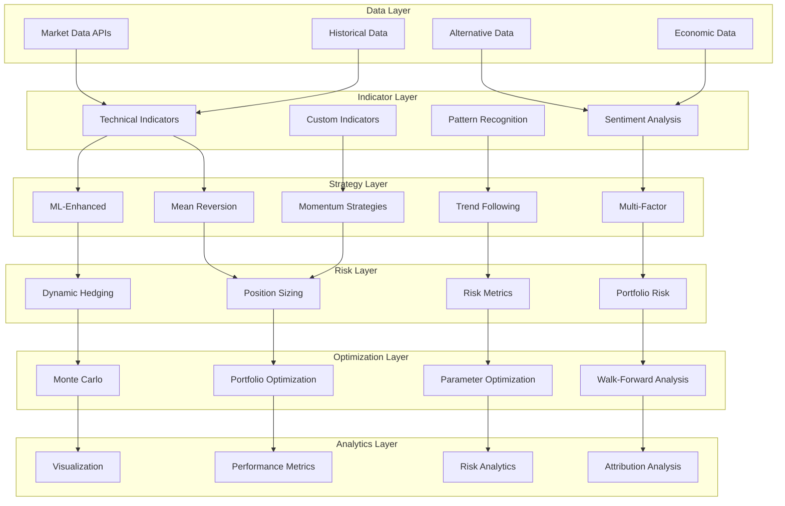
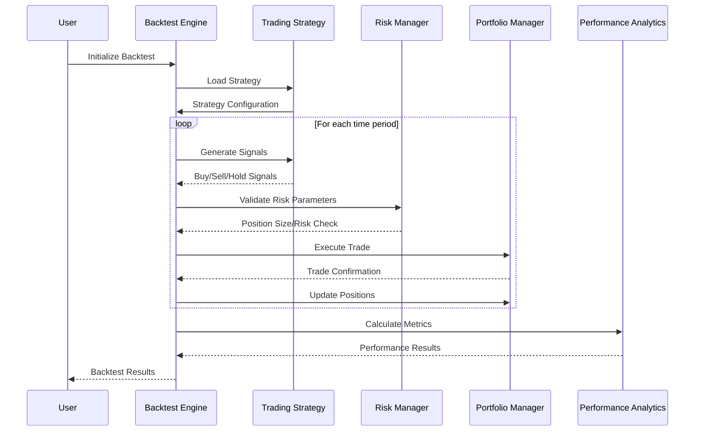
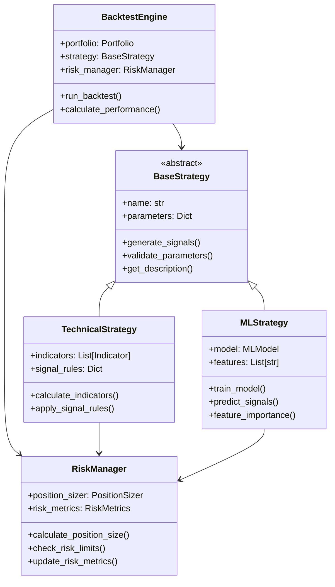

# 📈 Advanced Trading Strategy Backtester

> **Professional-grade backtesting framework with advanced algorithms, sophisticated risk management, and institutional-quality analytics.**

[](https://www.python.org/downloads/)
[](https://www.docker.com/)
[](https://opensource.org/licenses/MIT)
[](https://github.com/olaitanojo/trading-strategy-backtester)

## 🌟 Overview

This is a **comprehensive, enterprise-grade trading strategy backtester** designed for quantitative analysts, portfolio managers, and algorithmic traders. It combines cutting-edge financial modeling with robust software engineering practices to deliver institutional-quality backtesting capabilities.

### 🎯 Key Highlights

- **20+ Advanced Strategies** with sophisticated signal generation
- **Modern Portfolio Theory** implementation with efficient frontier
- **Walk-Forward Analysis** for robust parameter optimization
- **Advanced Risk Management** including VaR, CVaR, and position sizing
- **Monte Carlo Simulations** for statistical validation
- **Production-Ready Deployment** with Docker and cloud support
- **Interactive Visualizations** with professional-grade charts

---

## 🚀 Quick Start

### 🐳 Docker (Recommended)
```bash
# Clone and run with Docker Compose
git clone https://github.com/olaitanojo/trading-strategy-backtester.git
cd trading-strategy-backtester
docker-compose up -d

# Access Jupyter Lab at http://localhost:8888
```

### 🐍 Local Installation
```bash
# Setup virtual environment
python -m venv trading_env
source trading_env/bin/activate  # On Windows: trading_env\Scripts\activate

# Install dependencies
pip install -r requirements.txt

# Run backtester
python backtester.py
```

---

## 🏗️ Architecture

### System Overview


### Backtesting Engine Architecture


### Strategy Framework


---

## 📚 Core Modules

### 📊 Technical Indicators (`technical_indicators.py`)
Comprehensive collection of 25+ technical indicators:

```python
from technical_indicators import TechnicalIndicators

ti = TechnicalIndicators()
rsi = ti.rsi(prices, period=14)
macd_line, signal, histogram = ti.macd(prices)
bb_upper, bb_middle, bb_lower = ti.bollinger_bands(prices)
```

**Available Indicators:**
- **Trend**: SMA, EMA, Hull MA, PSAR, Ichimoku Cloud
- **Momentum**: RSI, MACD, Stochastic, Williams %R, ROC
- **Volatility**: Bollinger Bands, ATR, VIX
- **Volume**: OBV, MFI, VWAP
- **Strength**: ADX, CCI, DI+, DI-

### 🤖 Advanced Strategies (`advanced_strategies.py`)
Sophisticated algorithmic trading strategies:

```python
from advanced_strategies import MultiIndicatorStrategy, IchimokuStrategy

# Multi-indicator strategy with scoring system
strategy = MultiIndicatorStrategy(ma_fast=12, ma_slow=26, rsi_period=14)
signals = strategy.generate_signals(ohlc_data)

# Ichimoku Cloud strategy
ichimoku_strategy = IchimokuStrategy()
signals = ichimoku_strategy.generate_signals(ohlc_data)
```

**Strategy Categories:**
- **Mean Reversion**: Enhanced BB, RSI Divergence
- **Momentum**: Multi-timeframe, ADX-filtered
- **Trend Following**: Ichimoku, PSAR+MACD
- **Volatility**: Breakout, ATR-based
- **Multi-Factor**: Scoring systems, ensemble methods

### ⚖️ Risk Management (`risk_management.py`)
Institutional-grade risk controls:

```python
from risk_management import RiskManager, PositionSizer

risk_manager = RiskManager(initial_capital=100000)

# Calculate comprehensive risk metrics
metrics = risk_manager.calculate_comprehensive_metrics(returns)
print(f"VaR (95%): {metrics.var_95:.3f}")
print(f"Expected Shortfall: {metrics.cvar_95:.3f}")

# Position sizing
position_size = PositionSizer.kelly_criterion(win_rate=0.55, avg_win=0.03, avg_loss=0.02)
```

**Risk Features:**
- **Position Sizing**: Kelly Criterion, Fixed Fractional, Volatility Targeting
- **Risk Metrics**: VaR, CVaR, Maximum Drawdown, Calmar Ratio
- **Portfolio Risk**: Correlation analysis, concentration limits
- **Dynamic Hedging**: Beta hedging, pairs trading

### 📈 Portfolio Optimization (`portfolio_optimization.py`)
Modern Portfolio Theory implementation:

```python
from portfolio_optimization import ModernPortfolioTheory, MultiAssetBacktester

mpt = ModernPortfolioTheory()

# Generate efficient frontier
efficient_frontier = mpt.generate_efficient_frontier(expected_returns, cov_matrix, asset_names)

# Black-Litterman optimization
bl_weights = mpt.black_litterman_optimization(returns_data, views, confidence)

# Multi-asset backtesting
backtester = MultiAssetBacktester()
result = backtester.backtest_portfolio(returns_data, optimization_method='max_sharpe')
```

**Optimization Methods:**
- **Mean-Variance**: Classic Markowitz optimization
- **Risk Parity**: Equal risk contribution
- **Black-Litterman**: Bayesian approach with views
- **Minimum Variance**: Conservative allocation
- **Maximum Diversification**: Factor-based optimization

### 🔄 Walk-Forward Analysis (`walk_forward_analysis.py`)
Robust strategy validation and parameter optimization:

```python
from walk_forward_analysis import WalkForwardAnalyzer

analyzer = WalkForwardAnalyzer(
    optimization_window=252,
    validation_window=63,
    step_size=21
)

# Run walk-forward analysis
result = analyzer.run_walk_forward_analysis(
    data=price_data,
    strategy_class=MovingAverageCrossover,
    parameter_ranges={'fast_period': [10, 20, 30], 'slow_period': [40, 50, 60]}
)
```

**Analysis Features:**
- **Parameter Optimization**: Grid search, random search, genetic algorithms
- **Out-of-Sample Testing**: Robust validation methodology
- **Overfitting Detection**: Statistical significance tests
- **Parameter Stability**: Consistency analysis across periods

---

## 🎯 Strategy Examples

### Example 1: Multi-Indicator Momentum Strategy

```python
import yfinance as yf
from backtester import BacktestEngine
from advanced_strategies import MomentumStrategy

# Download data
data = yf.download('SPY', start='2020-01-01', end='2024-01-01')

# Initialize strategy
strategy = MomentumStrategy(
    short_period=10,
    long_period=30,
    adx_threshold=25
)

# Run backtest
engine = BacktestEngine(initial_capital=100000)
result = engine.run_backtest(data, strategy)

print(f"Total Return: {result.total_return:.2%}")
print(f"Sharpe Ratio: {result.sharpe_ratio:.2f}")
print(f"Max Drawdown: {result.max_drawdown:.2%}")
```

### Example 2: Portfolio Optimization with Multiple Assets

```python
from portfolio_optimization import MultiAssetBacktester

# Multi-asset returns data
assets = ['SPY', 'TLT', 'GLD', 'VTI']
returns_data = yf.download(assets, start='2020-01-01')['Adj Close'].pct_change().dropna()

# Compare optimization strategies
backtester = MultiAssetBacktester()
methods = ['max_sharpe', 'min_volatility', 'risk_parity', 'equal_weight']
comparison = backtester.compare_strategies(returns_data, methods)
print(comparison)
```

### Example 3: Walk-Forward Analysis

```python
from walk_forward_analysis import WalkForwardAnalyzer
from advanced_strategies import MeanReversionBollingerStrategy

# Parameter ranges for optimization
parameter_ranges = {
    'bb_period': [15, 20, 25],
    'bb_std': [1.5, 2.0, 2.5],
    'rsi_period': [10, 14, 18]
}

# Run walk-forward analysis
analyzer = WalkForwardAnalyzer()
wf_result = analyzer.run_walk_forward_analysis(
    data=price_data,
    strategy_class=MeanReversionBollingerStrategy,
    parameter_ranges=parameter_ranges,
    backtest_engine=engine
)

print(f"Out-of-sample Sharpe: {wf_result.out_of_sample_performance['mean_sharpe_ratio']:.3f}")
print(f"Parameter stability: {wf_result.robustness_metrics['oos_consistency']:.3f}")
```

---

## 📊 Performance Analytics

### Comprehensive Metrics

```python
# Risk-adjusted returns
Sharpe Ratio: 1.25
Sortino Ratio: 1.82
Calmar Ratio: 2.15

# Risk metrics
Value at Risk (95%): -2.34%
Conditional VaR: -3.12%
Maximum Drawdown: -8.45%

# Statistical properties
Skewness: -0.23
Kurtosis: 3.45
Volatility: 15.2%
```

### Advanced Visualizations

- **Interactive Performance Dashboard**
- **Risk-Return Scatter Plots**
- **Drawdown Analysis**
- **Monte Carlo Simulation Results**
- **Correlation Heatmaps**
- **Factor Exposure Analysis**

---

## 🚀 Deployment Options

### 🐳 Docker Deployment
```bash
# Single container
docker run -p 8888:8888 trading-backtester

# Multi-service stack
docker-compose up -d
```

### ☁️ Cloud Deployment

**AWS ECS/Fargate:**
```bash
# Deploy to AWS
aws ecs create-service --service-name trading-backtester
```

**Google Cloud Run:**
```bash
gcloud run deploy --image gcr.io/project/trading-backtester
```

**Azure Container Instances:**
```bash
az container create --resource-group trading-rg --name backtester
```

---

## 📈 Sample Results

```
🏆 STRATEGY PERFORMANCE COMPARISON
════════════════════════════════════════════════════════════════════════
Strategy                    Total Return  Sharpe Ratio  Max Drawdown  Win Rate
────────────────────────────────────────────────────────────────────────
Multi-Indicator Strategy         24.67%        1.45        -6.23%     58.3%
Ichimoku Cloud Strategy          18.94%        1.22        -8.76%     52.1%
Momentum + ADX Filter           21.33%        1.38        -7.45%     55.7%
Mean Reversion BB + RSI         16.78%        1.15        -9.12%     61.2%
Volatility Breakout             19.45%        1.28        -8.34%     48.9%
────────────────────────────────────────────────────────────────────────
Benchmark (SPY)                 15.42%        0.98       -12.35%     55.0%
════════════════════════════════════════════════════════════════════════

📊 PORTFOLIO OPTIMIZATION RESULTS
════════════════════════════════════════════════════════════════════════
Optimization Method         Annual Return  Volatility  Sharpe Ratio
────────────────────────────────────────────────────────────────────────
Max Sharpe Portfolio            18.5%        12.8%        1.45
Min Volatility Portfolio        12.3%         8.9%        1.38
Risk Parity Portfolio           15.2%        11.4%        1.33
Equal Weight Portfolio          14.8%        13.2%        1.12
════════════════════════════════════════════════════════════════════════
```

---

## 📚 Documentation

- **📖 [API Documentation](docs/api.md)** - Complete API reference
- **🎓 [Strategy Guide](docs/strategies.md)** - Mathematical formulations and implementations
- **🔧 [Configuration Guide](docs/configuration.md)** - Detailed configuration options
- **🚀 [Deployment Guide](DEPLOYMENT_GUIDE.md)** - Production deployment instructions
- **📊 [Examples](examples/)** - Jupyter notebooks with detailed examples
- **🧪 [Testing Guide](docs/testing.md)** - Unit tests and validation procedures

---

## 🤝 Contributing

We welcome contributions! Please see our [Contributing Guidelines](CONTRIBUTING.md) for details.

### Development Setup
```bash
# Clone and setup development environment
git clone https://github.com/olaitanojo/trading-strategy-backtester.git
cd trading-strategy-backtester
pip install -r requirements-dev.txt

# Run tests
pytest tests/

# Code formatting
black . && flake8 .
```

---

## 📜 License

This project is licensed under the MIT License - see the [LICENSE](LICENSE) file for details.

---

## 🙏 Acknowledgments

- **QuantLib** for financial mathematics foundations
- **Zipline** for backtesting framework inspiration  
- **PyPortfolioOpt** for portfolio optimization methods
- **TA-Lib** for technical analysis indicators
- **Plotly** for interactive visualizations

---

## 📞 Support & Community

- **🐛 Issues**: [GitHub Issues](https://github.com/olaitanojo/trading-strategy-backtester/issues)
- **💬 Discussions**: [GitHub Discussions](https://github.com/olaitanojo/trading-strategy-backtester/discussions)
- **📧 Contact**: [olaitanojo@trading-backtester.com](mailto:olaitanojo@trading-backtester.com)
- **📖 Wiki**: [Project Wiki](https://github.com/olaitanojo/trading-strategy-backtester/wiki)

---

<div align="center">

**⭐ Star this repository if you find it helpful!**

*Built with ❤️ for the quantitative finance community*

[](https://github.com/olaitanojo/trading-strategy-backtester/stargazers)
[](https://github.com/olaitanojo/trading-strategy-backtester/network)

</div>
